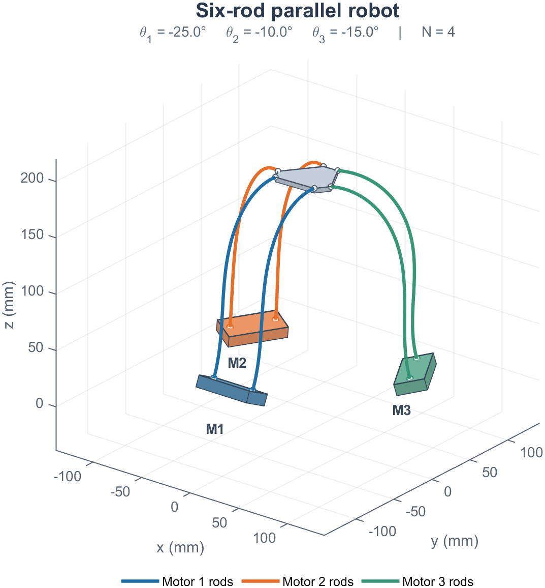

# Constraint-Free Continuum Parallel Robot

MATLAB implementation of the robot in **Constraint-Free Static Modeling of Continuum Parallel Robot**. This package provides editable parameters and independent control of its three motors. The example trajectory can be replaced with your own commands.

The rod kernels come from the author's original code. Rod attachments are eliminated through boundary-pose embeddings. The pulley force and its configuration derivative are updated during equilibrium iterations. The general simulation engine is not required. Tested with MATLAB R2023b on Windows; only MATLAB is needed.



## Start here

Open MATLAB in this directory and run:

```matlab
robot = demo_robot_controls;        % editable example, with live plot
% robot = demo_robot_controls(false); % without live plotting
```

Edit the parameter block and the `motor_control` function in this file. The example demonstrates direct commands followed by callback control, and saves its results to a new timestamped directory.

## Direct motor commands

```matlab
cfg = robot_parameters;
cfg.N = 4;                         % elements per rod
cfg.L = 0.19;                      % m
cfg.E = 1.13e10;                   % Pa
cfg.pulley.tension = 0;            % N
robot = CPRRobot(cfg);
info = robot.initialize;
assert(info.converged, 'Initialization failed');

robot.setMotorAngles(deg2rad([-10; -20; -5]));
info = robot.solve;
assert(info.converged, 'Motor command failed');
robot.setMotorAngle(2, deg2rad(-30)); % change only motor 2's target
info = robot.solve;
assert(info.converged, 'Motor command failed');
robot.plot;
T = robot.getPlatformPose;         % body-to-world 4-by-4 pose, position in m
```

Angles are **absolute angles in radians**, ordered by physical motor `[1;2;3]`. Positive rotation follows the right-hand rule about the configured world axis. Setters change targets; `solve` computes their equilibrium. `MotorAngles` holds the last accepted angles and `TargetMotorAngles` holds the requested angles. Motor labels appear in the shape plot.

## Callback control

The callback receives `(step, targetTime, robot)`. It sets the current step's targets; equilibrium is solved after it returns. The callback can read `robot.getPlatformPose` to use the previous accepted equilibrium.

```matlab
robot.setCallback(@motor_control);
report = robot.run(100, 0.1);
assert(report.completed, 'A command did not converge');

% Place this function at the end of your script, or in motor_control.m.
function motor_control(step, t, robot) %#ok<INUSD>
    robot.setMotorAngles(deg2rad([-15*sin(t); -20*sin(0.7*t); -10*sin(1.2*t)]));
end
```

`run` advances time by `dt` only after an accepted command. `solve` accepts a command without advancing time. The step counter counts accepted commands across both methods. These are **quasi-static equilibria**: `dt` parameterizes your commands, not a dynamic integrator.

## Loads, geometry and plotting

Material, mesh, attachment transforms, motor axes, initial angles and solver settings are in [robot_parameters.m](robot_parameters.m). Change these before constructing the robot. All six rods share the same material and mesh. Topology remains six rods, two per motor, connected to one platform. See [parameter documentation](docs/PARAMETERS.md).

Runtime load changes use the same equilibrium interface:

```matlab
robot.setPulleyTension(0.020*9.81); % N
robot.setGravity([0;0;-9.81]);      % m/s^2
info = robot.solve;
```

For plotting during `run`, set `cfg.visualization.enabled=true` before construction. `cfg.visualization.every` controls the plotting interval. The figure is reused with a fixed view and fixed axis limits. Motors are shown as rectangular solids that follow their actual motor poses, the platform is a thin plate, and each pair of rods uses its motor's color. These rigid shapes are display geometry only.

```matlab
cfg.visualization.view = [38 24];     % azimuth and elevation, degrees
cfg.visualization.lockView = true;   % fixed camera; mouse rotation/zoom disabled
cfg.visualization.axisLimits = [];   % default fixed limits, or a 3-by-2 matrix in m
% cfg.visualization.lockView = false; % allow mouse rotation and zoom
```

Set these before constructing the robot. The optional `axisLimits` rows are `[xmin xmax; ymin ymax; zmin zmax]`. Motor width, height, end padding, platform thickness and rod line width are also editable in `robot_parameters.m`.

## Save and inspect results

```matlab
robot.saveResults('results/my_run'); % choose a new directory
data = robot.results;               % plain structures, no engine object
f = openfig('results/my_run/robot_shape.fig','new','visible');
rotate3d(f,'on');
```

- `states.mat`: accepted states, parameters, initialization and iteration histories.
- `trajectory.csv`: time, step, physical motor angles, loads, platform pose and solver statistics. Data use SI units.
- `attempts.csv`: every continuation attempt, including failures. `accepted` refers to a substep; `command_accepted` identifies whether the whole command succeeded.
- `robot_shape.fig`, `robot_shape.png`: reconstructed rod shapes; plotting positions use mm.

A failed full command leaves the previous accepted state, angles, loads, time and step intact. Its attempted substeps remain in the log. Check `info.converged` or `report.completed` before using a result. `info.updates`, `evaluations` and `seconds` sum over the command's attempts; detailed histories are in `Attempts`. Cold initialization is stored separately as `InitializationInfo`.

## Verification and implementation

```matlab
report = run_tests;
```

Tests cover the pulley derivative, element energy gradient, original explicit-constraint regression fixtures, motor numbering, separate motor commands, parameter changes, callback timing, saved outputs and rollback after a failed command. Release verification reports are in [docs/validation](docs/validation). Running the tests writes a new report to `results/tests.json`; generated results are excluded from version control.

With N elements per rod, the independent system contains `72*N-30` unknowns: platform pose, internal rod poses and strain slopes. Endpoint poses are reconstructed exactly from the motor and platform poses. No connection multipliers are solved. The elastic tangent retains the original Gauss-Newton approximation; the pulley tangent is the full derivative of its body residual. Formula and scaling details are in [MODEL.md](docs/MODEL.md).

This repository contains the configurable six-rod robot and its tests. It does not include the general simulation engine or the PLS benchmark implementation.

## Citation and license

Cite **Constraint-Free Static Modeling of Continuum Parallel Robot**, IEEE Robotics and Automation Letters. Publication identifiers will be added when available. Source provenance is recorded in [docs/source_provenance.json](docs/source_provenance.json).

The code is released under the [MIT License](LICENSE). Copyright (c) 2026 Lingxiao Xun.
